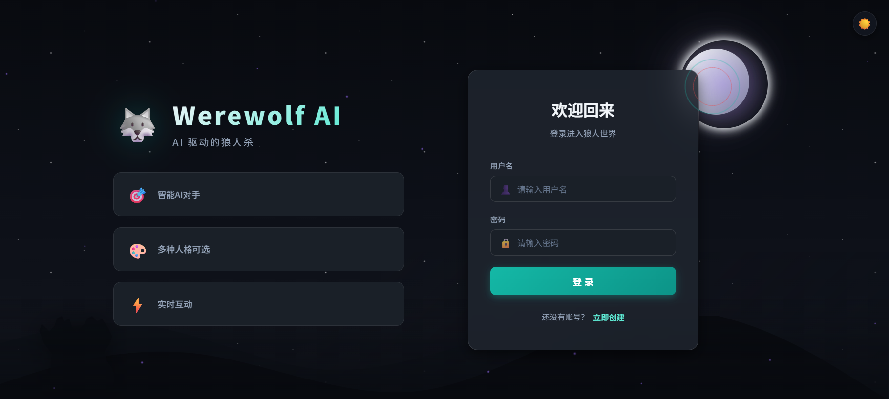
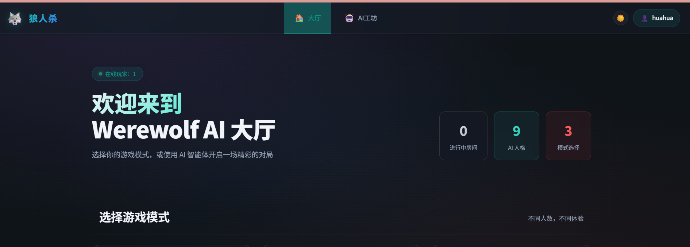
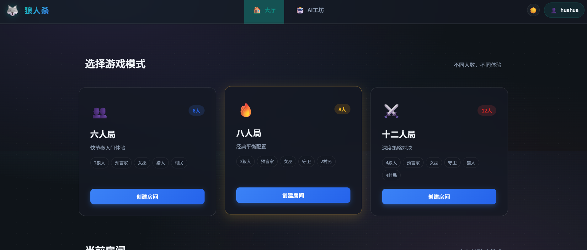
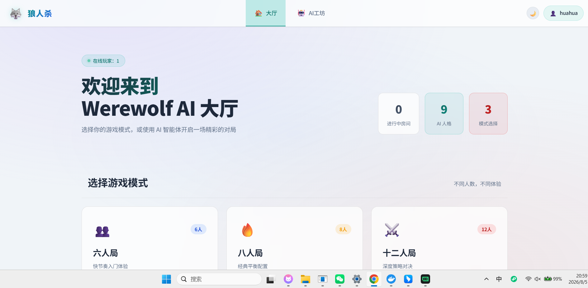
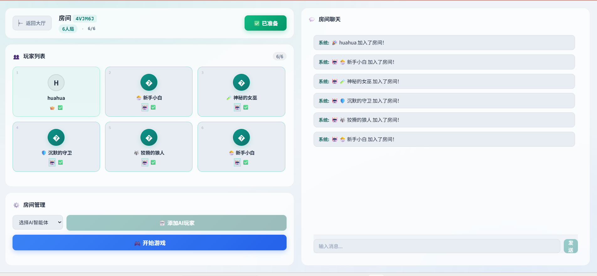
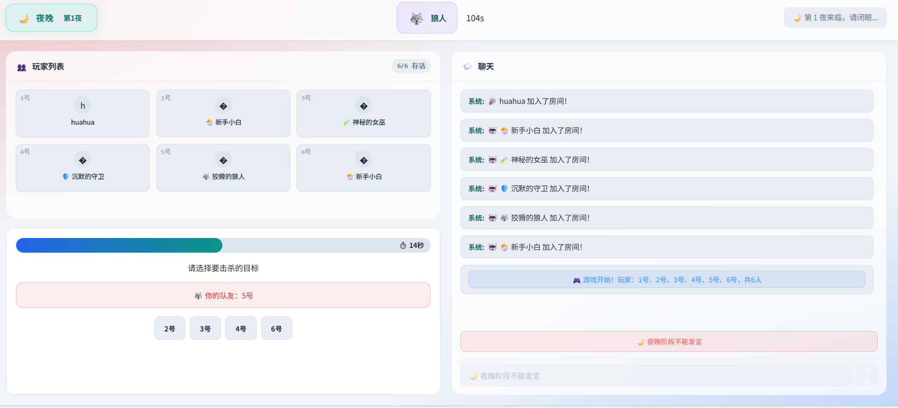
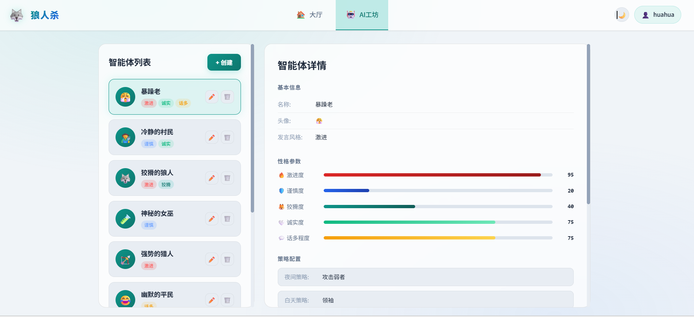

# 🐺 狼人杀 (Werewolf)

一款基于 WebSocket 的多人实时狼人杀游戏，支持 AI 智能体，可在 AI 工坊中创建自定义 AI 角色。

## �️ 界面展示

### 登录页


### 大厅页




### 房间页


### 游戏页



### AI 工坊


## �🛠️ 技术栈

### 后端
- **Node.js** + **Express** - Web 服务
- **Socket.IO** - 实时通信
- **MySQL** - 数据存储
- **Redis** + **node-cache** - 缓存同步与进程内热缓存
- **bcryptjs** - 密码加密
- **JWT** - 用户认证
- **LangChain** + **OpenAI API** - AI 智能体集成

### 前端
- **Vue 3** + **Vite** - 前端框架与构建
- **Pinia** - 状态管理
- **Vue Router** - 路由
- **Socket.IO Client** - 实时通信
- **Axios** - HTTP 请求

## 📁 项目结构

```
Newwerewolf/
├── backend/
│   ├── src/
│   │   ├── app.js                    # 应用入口
│   │   ├── config/
│   │   │   ├── db.js                 # 数据库配置与初始化
│   │   │   └── redis.js              # Redis 连接与状态管理
│   │   ├── ai/
│   │   │   └── AIAgentManager.js     # AI 智能体管理
│   │   ├── game/
│   │   │   ├── GameEngine.js         # 游戏引擎核心
│   │   │   ├── AIGameHandler.js      # AI 游戏处理（决策、发言、遗言、夜间行动）
│   │   │   ├── NightPhaseMixin.js    # 夜晚阶段逻辑（含狼人投票广播）
│   │   │   ├── RoleConfig.js         # 角色配置
│   │   │   └── constants.js          # 常量定义
│   │   ├── knowledge/                # 规则知识库（用于 RAG 和 AI 策略）
│   │   │   ├── basic-rules.md        # 基础规则
│   │   │   ├── roles.md              # 角色说明
│   │   │   ├── standard-flow.md      # 标准流程
│   │   │   └── strategies/
│   │   │       ├── role-guide.md     # 角色玩法指南
│   │   │       └── special-situations.md # 特殊情境应对
│   │   ├── middleware/
│   │   │   └── auth.js               # 认证中间件
│   │   ├── models/
│   │   │   ├── User.js               # 用户模型
│   │   │   └── GameRecord.js         # 游戏记录模型
│   │   ├── routes/
│   │   │   ├── auth.js               # 认证路由
│   │   │   └── aiAgentRoutes.js      # AI 智能体路由
│   │   ├── services/
│   │   │   ├── GameRetriever.js      # RAG 知识检索
│   │   │   └── RuleQAService.js      # 规则问答服务
│   │   ├── socket/
│   │   │   ├── index.js              # Socket.IO 入口
│   │   │   ├── roomHandler.js        # 房间管理（含规则问答）
│   │   │   └── gameHandler.js        # 游戏事件处理
│   │   └── utils/
│   │       ├── AppError.js           # 自定义错误类
│   │       ├── cache.js              # 缓存工具
│   │       └── userSocketMap.js      # 用户-Socket映射
│   ├── .env                          # 环境变量
│   ├── .env.example                  # 环境变量示例
│   ├── Dockerfile                    # 后端 Docker 镜像
│   └── package.json
├── frontend/
│   ├── src/
│   │   ├── assets/
│   │   │   └── style.css             # 全局样式
│   │   ├── components/
│   │   │   ├── ChatBox.vue           # 聊天组件
│   │   │   ├── ConfirmDialog.vue    # 全局确认对话框
│   │   │   ├── Countdown.vue         # 倒计时组件
│   │   │   ├── DayPanel.vue          # 白天发言面板
│   │   │   ├── NightPanel.vue        # 夜晚行动面板（含狼人投票实时显示）
│   │   │   ├── VotePanel.vue         # 投票面板
│   │   │   ├── HunterPanel.vue       # 猎人开枪面板
│   │   │   ├── PlayerList.vue        # 玩家列表
│   │   │   ├── RoleReveal.vue        # 身份揭示
│   │   │   └── GameResult.vue        # 游戏结果
│   │   ├── composables/
│   │   │   └── useConfirm.js         # 确认对话框逻辑
│   │   ├── utils/
│   │   │   └── markdown.js           # Markdown 渲染（规则问答用）
│   │   ├── views/
│   │   │   ├── LoginView.vue         # 登录页
│   │   │   ├── LobbyView.vue         # 大厅页（含排行榜）
│   │   │   ├── RoomView.vue          # 房间页（含规则问答按钮）
│   │   │   ├── GameView.vue          # 游戏页（含规则问答按钮）
│   │   │   ├── ProfileView.vue       # 个人中心
│   │   │   └── AIAgentWorkshop.vue   # AI 工坊
│   │   ├── stores/
│   │   │   ├── user.js               # 用户状态
│   │   │   ├── room.js               # 房间状态
│   │   │   ├── game.js               # 游戏状态（含狼人投票状态）
│   │   │   └── theme.js              # 主题状态（暗色/亮色切换）
│   │   ├── router/
│   │   │   └── index.js              # 路由配置
│   │   ├── api.js                    # API 封装
│   │   ├── socket.js                 # Socket 封装
│   │   ├── App.vue                   # 应用根组件
│   │   └── main.js                   # 应用入口
│   ├── index.html
│   ├── Dockerfile                    # 前端 Docker 镜像（含 Nginx）
│   ├── nginx.conf                    # Nginx 配置（SPA + 反向代理）
│   ├── vite.config.js
│   └── package.json
├── .gitignore
├── .dockerignore
├── docker-compose.yml         # Docker 编排配置
└── README.md
```

## 🚀 快速开始

### 方式一：Docker 一键部署（推荐）

> 环境要求：[Docker Desktop](https://www.docker.com/products/docker-desktop/)

```bash
# 克隆项目
git clone <your-repo-url>
cd Newwerewolf

# 一键启动（前端 + 后端 + MySQL + Redis）
docker-compose up -d --build
```

启动后访问 **http://localhost** 即可开始游戏。

```bash
# 查看日志
docker-compose logs -f

# 停止服务
docker-compose down

# 停止并清空数据库与 Redis 数据
docker-compose down -v
```

#### Docker 架构

```
浏览器 (http://localhost)
    │
    ▼
┌──────────────┐
│   frontend   │  Nginx :80
│  (Vue + Nginx)│
└──────┬───────┘
       │ /api/* 和 /socket.io/* 反向代理
       ▼
┌──────────────┐
│   backend    │  Node.js :3001
│  (Express)   │
└───┬────────┬─┘
    │        │
    ▼        ▼
┌────────┐ ┌────────┐
│ mysql  │ │ redis  │
│ 数据库 │ │ 缓存   │
└────────┘ └────────┘
```

### 方式二：本地开发

#### 环境要求
- Node.js >= 18.x
- MySQL >= 8.0
- Redis >= 7.0（Docker 开发模式会自动启动）

#### 1. 安装依赖

```bash
# 后端
cd backend
npm install

# 前端
cd ../frontend
npm install
```

#### 2. 配置环境变量

复制 `backend/.env.example` 为 `backend/.env` 并修改配置：

```bash
cp backend/.env.example backend/.env
```

```env
# 数据库配置
DB_HOST=localhost
DB_PORT=3306
DB_USER=root
DB_PASSWORD=your_password
DB_NAME=werewolf

# Redis 缓存配置
REDIS_URL=redis://localhost:6379/0
REDIS_KEY_PREFIX=werewolf

# JWT 配置
JWT_SECRET=please_generate_a_strong_secret_key
JWT_EXPIRES_IN=7d

# 服务端口
PORT=3000

# AI API 配置（可选，不配置则使用 fallback 逻辑）
DEEPSEEK_API_KEY=your_deepseek_api_key
DEEPSEEK_API_URL=https://api.deepseek.com
MODEL_NAME=deepseek-chat

# 或使用 小米 Mimo API（二选一）
XIAOMI_API_KEY=your_xiaomi_api_key
XIAOMI_API_URL=https://api.xiaomimimo.com
XIAOMI_MODEL_NAME=mimo-v2-flash

# CORS 允许的源（逗号分隔）
CORS_ORIGINS=http://localhost:5173,http://127.0.0.1:5173
```

#### 3. 启动项目

```bash
# 启动后端
cd backend
npm run dev

# 启动前端（新终端）
cd frontend
npm run dev
```

访问 http://localhost:5173 即可开始游戏。

## 🎮 游戏功能

### 核心玩法
- 🔄 支持 6 / 8 / 12 人游戏模式
- 🐺 6 种角色：狼人、村民、预言家、女巫、猎人、守卫
- 🌙 **夜晚阶段**（30秒/角色）：狼人杀人、预言家查验身份、女巫使用解药/毒药、守卫守护玩家
- 💀 **死亡遗言阶段**（15秒/人）：夜晚死亡的玩家依次发表遗言
- 💬 **自由讨论阶段**（45秒）：所有人自由发言，AI 玩家也会并行参与讨论
- ☀️ **轮流发言阶段**（30秒/人）：按座位号顺序依次发言
- 🗳️ **投票阶段**（30秒）：放逐投票，平票时进入 PK 加赛
- 🔫 **猎人机制**：猎人死亡时可开枪带走一名玩家（被毒杀时不可开枪，10秒决策窗口）

### 规则问答系统
- 📖 **游戏规则问答卡片**：房间和游戏内都有「游戏规则」按钮，点击弹出独立问答面板
- ❓ 快捷问题按钮：预置 5 个常见规则问题，一键提问
- 🤖 RAG 智能检索：基于游戏规则知识库（角色说明、标准流程、特殊情境、战术手册）生成精准回答
- 🔒 **问答不进入聊天框**：通过独立的 `rule_qa` Socket 事件通道，问答历史仅提问者可见，不污染公共聊天
- 📝 Markdown 格式渲染：回答以标题、加粗、列表等格式美观展示

### 房间系统
- 🆔 创建/加入房间（6位房间码）
- ✅ 准备/取消准备
- 💬 实时聊天
- 📊 玩家状态同步
- 🎮 开始游戏 / 返回房间
- 🔄 断线自动重连（60秒宽限期）
- 🏆 实时排行榜：按积分和胜场排序，展示 Top 50 玩家

### 狼人协作
- 🐺 **狼人实时队友击杀投票**：夜晚狼人阶段，所有存活狼人能实时看到每位队友选择的击杀目标
- ✅ 统一目标提示：当所有狼人选择相同时，显示「狼人已统一目标」
- ✏️ 可修改击杀选择：提交后可点击「修改击杀目标」重新选择

### AI 智能体
- 🤖 AI 工坊：创建、编辑、删除 AI 智能体
- 🎭 自定义 AI 角色人设（激进度、谨慎度、狡猾度、诚实度、话多程度）
- 🗣️ 自定义发言风格（幽默、严肃、激进、冷静、神秘）
- 📝 自定义语言习惯（口头禅前缀/后缀、常用词）
- 🧠 自定义策略（夜间策略、白天策略、身份暴露时机）
- 👥 AI 玩家可加入房间参与游戏
- 💡 AI 自动发言和决策（支持 LLM 或 fallback 模板）

**LLM 配置与 fallback 机制：**
- 配置 `.env` 中的 `XIAOMI_API_KEY` 或 `DEEPSEEK_API_KEY` 启用大模型推理
- 不配置 API Key 时自动降级为模板引擎（fallback），不影响游戏运行
- LLM 超时保护：聊天 12s / 夜晚行动 15s / 遗言 10s，超时自动回退模板
- AI 信息隔离：只暴露自己角色 + 狼人队友身份，其他人均为 unknown，保证公平性
- AI 决策基于公开信息：预言家查验结果被跟随，被多人怀疑的玩家更可能被投
- 可通过 `docker-compose logs -f backend | grep AIGameHandler` 观察 LLM 调用情况

### 特色功能
- 🌓 **暗色/亮色主题切换**：一键切换界面主题，偏好自动保存
- 📜 游戏结束自动复盘（结构化 JSON 复盘卡片：身份揭晓、按夜分组行动记录、胜负玩家）
- 🗳️ 投票平票自动进入 PK 加赛（一轮，再平票则无人出局）
- 🔄 断线重连保持游戏状态（socketId=null 标记，60秒宽限期）
- 📱 响应式布局，支持移动端
- 🔐 JWT 认证 + Socket.IO 认证中间件
- 🛡️ 接口限流保护
- 🤝 同一账号多设备登录自动踢出旧连接
- 💬 自定义弹窗系统：替换浏览器原生 alert/confirm，提供统一美观的对话框体验

## 📡 API 接口

### 认证
| 方法 | 路径                   | 说明             |
| ---- | ---------------------- | ---------------- |
| POST | `/api/auth/register`   | 用户注册         |
| POST | `/api/auth/login`      | 用户登录         |
| GET  | `/api/auth/me`         | 获取当前用户信息 |
| PUT  | `/api/auth/me`         | 更新用户资料     |
| GET  | `/api/auth/api-config` | 获取 API 配置    |
| PUT  | `/api/auth/api-config` | 更新 API 配置    |

### AI 智能体
| 方法   | 路径                 | 说明           |
| ------ | -------------------- | -------------- |
| GET    | `/api/ai-agents`     | 获取智能体列表 |
| GET    | `/api/ai-agents/:id` | 获取单个智能体 |
| POST   | `/api/ai-agents`     | 创建智能体     |
| PUT    | `/api/ai-agents/:id` | 更新智能体     |
| DELETE | `/api/ai-agents/:id` | 删除智能体     |

### 房间
| 方法 | 路径              | 说明                      |
| ---- | ----------------- | ------------------------- |
| GET  | `/api/rooms`      | 获取活跃房间列表          |
| GET  | `/api/room/:code` | 获取房间详情              |
| GET  | `/api/health`     | 健康检查（含 Redis 状态） |

## 🔌 Socket 事件

### 房间事件
| 事件名             | 方向          | 说明           |
| ------------------ | ------------- | -------------- |
| `create_room`      | 客户端→服务器 | 创建房间       |
| `join_room`        | 客户端→服务器 | 加入房间       |
| `leave_room`       | 客户端→服务器 | 离开房间       |
| `player_ready`     | 客户端→服务器 | 切换准备状态   |
| `add_ai_player`    | 客户端→服务器 | 添加 AI 玩家   |
| `remove_ai_player` | 客户端→服务器 | 移除 AI 玩家   |
| `room_joined`      | 服务器→客户端 | 已加入房间     |
| `room_update`      | 服务器→客户端 | 房间信息更新   |
| `room_created`     | 服务器→客户端 | 新房间创建通知 |
| `room_deleted`     | 服务器→客户端 | 房间删除通知   |
| `chat`             | 客户端→服务器 | 发送聊天消息   |
| `chat_message`     | 服务器→客户端 | 收到聊天消息   |
| `rule_qa`          | 客户端→服务器 | 提交规则问题   |
| `rule_qa_answer`   | 服务器→客户端 | 收到规则回答（单播给提问者） |

### 游戏事件
| 事件名                | 方向          | 说明                     |
| --------------------- | ------------- | ------------------------ |
| `start_game`          | 客户端→服务器 | 开始游戏                 |
| `game_started`        | 服务器→客户端 | 游戏已开始（含角色信息） |
| `phase_change`        | 服务器→客户端 | 阶段变化                 |
| `night_action`        | 客户端→服务器 | 夜晚行动                 |
| `night_action_prompt` | 服务器→客户端 | 夜晚行动提示             |
| `night_role_turn`     | 服务器→客户端 | 当前夜晚角色行动阶段     |
| `night_role_done`     | 服务器→客户端 | 当前夜晚角色行动结束     |
| `werewolf_vote_update`| 服务器→客户端 | 狼人队友击杀投票更新（只发给狼人） |
| `seer_result`         | 服务器→客户端 | 预言家查验结果           |
| `night_result`        | 服务器→客户端 | 夜晚结果（死亡信息）     |
| `hunter_shoot`        | 客户端→服务器 | 猎人开枪                 |
| `hunter_trigger`      | 服务器→客户端 | 猎人触发提示             |
| `hunter_result`       | 服务器→客户端 | 猎人开枪结果             |
| `vote`                | 客户端→服务器 | 提交投票                 |
| `vote_update`         | 服务器→客户端 | 投票进度更新             |
| `vote_result`         | 服务器→客户端 | 投票结果                 |
| `speaker_change`      | 服务器→客户端 | 发言者切换               |
| `next_speaker`        | 客户端→服务器 | 下一位发言               |
| `skip_speaking`       | 客户端→服务器 | 跳过发言                 |
| `skip_day`            | 客户端→服务器 | 跳过白天讨论             |
| `game_over`           | 服务器→客户端 | 游戏结束                 |
| `reset_game`          | 客户端→服务器 | 重置游戏返回房间         |
| `force_logout`        | 服务器→客户端 | 强制下线（多设备登录）   |

## 🎯 游戏流程

```
等待阶段 → 夜晚阶段 → 死亡遗言 → 自由讨论 → 轮流发言 → 投票阶段 → (循环) → 游戏结束
   ↓           ↓           ↓           ↓           ↓           ↓
 准备开始   夜晚行动    死者遗言    所有人发言   按序发言    放逐投票
                         ↑                                              平安夜则跳过遗言
```

### 阶段计时
| 阶段 | 时长 | 说明 |
| --- | --- | --- |
| 夜晚 | 30秒/角色（150秒总预算） | 守卫→狼人→预言家→女巫 |
| 死亡遗言 | 15秒/人 | 死者依次发言 |
| 自由讨论 | 45秒 | 所有人可发言 |
| 轮流发言 | 30秒/人 | 按座位号顺序 |
| 投票 | 30秒 | 平票进入 PK 加赛 |
| 游戏结束 | 15秒 | 展示复盘卡片 |

### 夜晚行动顺序
1. 🛡️ 守卫守护（30秒，不能连续两晚守护同一人）
2. 🐺 狼人杀人（30秒，多狼投票多数决）
3. 🔮 预言家查验（30秒）
4. 🧪 女巫行动（30秒，每晚三选一：救人/毒人/跳过）

### 角色说明

| 角色     | 阵营 | 能力                                   |
| -------- | ---- | -------------------------------------- |
| 🐺 狼人   | 狼人 | 每晚选择击杀一名玩家（多狼投票多数决）  |
| 👨‍🌾 村民   | 村民 | 无特殊能力，通过推理找出狼人           |
| 🔮 预言家 | 村民 | 每晚查验一名玩家的身份                 |
| 🧪 女巫   | 村民 | 解药和毒药各限用一次，每晚三选一（救/毒/跳过），同守同救判死 |
| 🏹 猎人   | 村民 | 被淘汰时可开枪带走一人（被毒杀时不可，10秒决策窗口） |
| 🛡️ 守卫   | 村民 | 每晚守护一名玩家（不能连续守护同一人） |

### 角色分配

| 模式 | 狼人 | 预言家 | 女巫 | 守卫 | 猎人 | 村民 |
| ---- | ---- | ------ | ---- | ---- | ---- | ---- |
| 6人  | 2    | 1      | 1    | -    | 1    | 1    |
| 8人  | 3    | 1      | 1    | 1    | -    | 2    |
| 12人 | 4    | 1      | 1    | 1    | 1    | 4    |

## 🛠️ 开发说明

### 开发模式
```bash
# 后端 - 自动重启
cd backend
npm run dev

# 前端 - HMR 热更新
cd frontend
npm run dev
```

### 生产构建
```bash
# 前端构建
cd frontend
npm run build

# 后端启动
cd backend
npm start
```

### 数据库自动初始化
后端首次启动时会自动创建数据库和表结构：
- `users` - 用户表（id, username, password, api_key, api_url, model_name, created_at）
- `game_records` - 游戏记录表（id, room_code, winner, player_count, duration, created_at）
- `game_players` - 游戏玩家表（id, game_id, user_id, role, is_winner）
- `ai_agents` - AI 智能体表（id, name, avatar, personality, speaking_style, strategy, language, created_at_ms, updated_at_ms）

## 📄 License

MIT License
