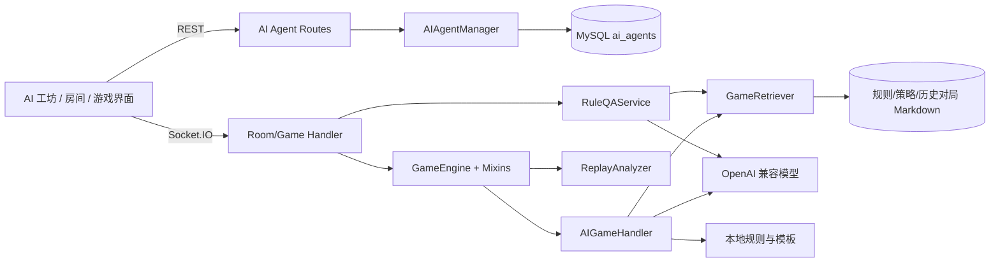
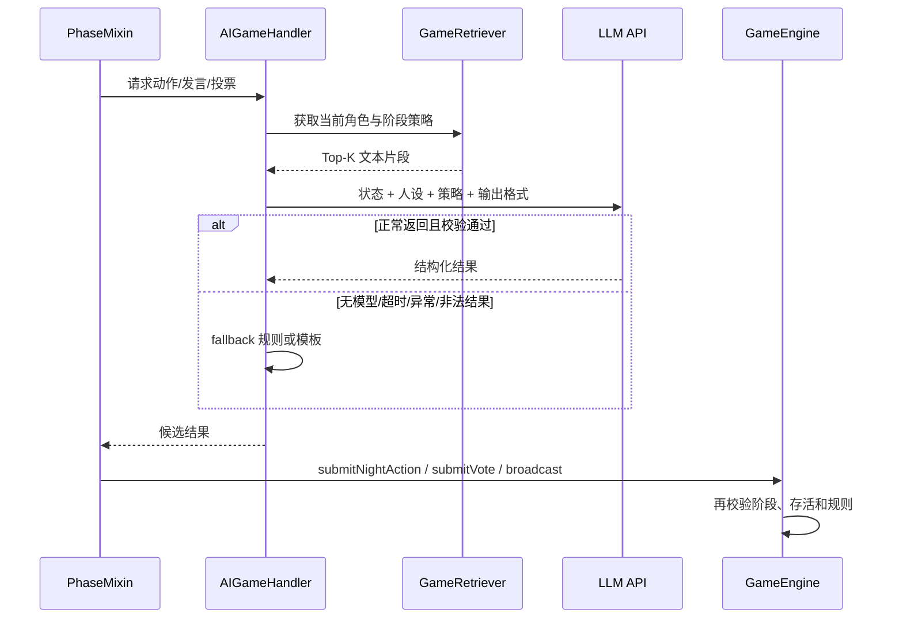

# Werewolf AI 系统实现详解与优化方案

> 文档基于当前仓库代码整理，目标是说明项目中所有主要 AI 能力的真实实现、运行链路、边界与后续优化方向。本文描述的是当前实现，而不是理想化架构。

## 1. 总览

本项目的 AI 系统由五部分组成：

1. **AI 智能体管理**：定义 AI 的名称、性格、语言习惯和策略，并持久化到 MySQL。
2. **AI 对局玩家**：在服务端模拟普通玩家，参与夜间行动、白天发言、投票和遗言。
3. **RAG 策略与规则检索**：从本地 Markdown 知识库检索相关片段，注入 LLM Prompt。
4. **规则问答**：玩家通过 Socket.IO 提问，系统检索规则并由 LLM 生成回答。
5. **赛后复盘与可观测性**：用本地算法生成基础复盘，可选使用 LLM 润色，并记录检索和决策统计。

当前 AI 采用“**规则引擎保证流程 + LLM 提升表达和策略 + fallback 保证可用性**”的混合方式。游戏规则、阶段推进和动作提交仍由 `GameEngine` 控制，LLM 不能直接修改游戏状态。



## 2. 关键代码分布

| 模块                                     | 主要职责                                                              |
| ---------------------------------------- | --------------------------------------------------------------------- |
| `backend/src/game/AIGameHandler.js`      | AI 玩家创建、夜间决策、投票、发言、遗言、fallback、并发限制和决策日志 |
| `backend/src/services/GameRetriever.js`  | 知识加载、分块、加权检索、缓存、历史对局写入和检索统计                |
| `backend/src/services/RuleQAService.js`  | 规则问答 Prompt、LLM 调用与无模型降级                                 |
| `backend/src/game/ReplayAnalyzer.js`     | 本地赛后分析、投票关系图、时间线和可选 LLM 总结                       |
| `backend/src/ai/AIAgentManager.js`       | 默认智能体、输入清洗、配置归一化和 CRUD                               |
| `backend/src/models/AIAgent.js`          | `ai_agents` 表的数据访问与 JSON 字段转换                              |
| `backend/src/game/*PhaseMixin.js`        | 在游戏阶段中触发 AI，并将 AI 结果提交给规则引擎                       |
| `backend/src/socket/roomHandler.js`      | 添加/移除 AI、普通聊天和规则问答 Socket 入口                          |
| `backend/src/socket/gameHandler.js`      | 游戏结束持久化、复盘分析和历史对局入库                                |
| `backend/src/routes/stats.js`            | 管理员 AI 检索与决策聚合统计                                          |
| `frontend/src/views/AIAgentWorkshop.vue` | AI 人设、语言和策略配置界面                                           |
| `frontend/src/views/RoomView.vue`        | 选择智能体并加入房间                                                  |

## 3. 模型接入

### 3.1 模型初始化

`AIGameHandler` 和 `RuleQAService` 通过 OpenAI 兼容协议访问模型，模型实例由 `llmConfig.buildModel` 按配置签名缓存：

- API Key / Base URL / 模型名：由用户在「设置」页配置，绑定到用户账号（存 `users` 表），系统不内置任何默认模型。
- 房间 AI：使用房主的 Key；规则问答：使用提问者的 Key。
- 对局 AI：默认 `temperature=0.7`、`maxTokens=1000`。
- 规则问答：`temperature=0.2`、`maxTokens=800`，以降低规则回答的随机性。

没有配置 API Key 时，模型对象保持为 `null`，所有核心游戏行为进入本地 fallback，游戏仍可继续。

### 3.2 LangChain 的作用

项目只使用 LangChain 的轻量能力：

- `PromptTemplate`：拼装提示词。
- `ChatOpenAI`：调用 OpenAI 兼容模型。
- `StructuredOutputParser`：约束夜间动作、投票和发言为结构化输出。
- `StringOutputParser`：解析规则问答文本。

当前没有使用 Agent executor、工具调用、LangGraph、长期记忆或向量存储。

## 4. AI 智能体如何实现

### 4.1 智能体数据模型

AI 智能体不是一个独立运行的 Agent 进程，而是一组影响 Prompt 和后处理的配置。核心字段包括：

- `name`、`avatar`：展示身份。
- `personality`：`aggressiveness`、`caution`、`cunning`、`honesty`、`talkativeness`，取值 0 至 100。
- `speakingStyle`：如幽默、严肃、激进、冷静、神秘。
- `strategy`：夜间行动、白天策略、身份暴露时机等偏好。
- `language`：常用前缀、后缀和口头禅。
- `ownerId`：自定义智能体的所有者；内置智能体为 `null`。

`AIAgentManager` 提供默认智能体，并在首次启动时批量写入数据库。创建和更新时会归一化数值、枚举和数组，并对文本做去控制字符、去换行和长度截断，以降低 Prompt 注入及异常输入风险。

### 4.2 权限与持久化

REST 路由为 `/api/ai-agents`。管理员可修改所有智能体；普通用户只能修改自己创建的智能体；内置智能体只能由管理员修改。数据存储在 MySQL `ai_agents` 表中，性格、策略和语言字段以 JSON 字符串保存。

### 4.3 AI 玩家实例化

房主选择智能体后，服务端调用 `createAIPlayer(roomCode, agentId)`，生成与真人玩家结构兼容的对象：

```js
{
  socketId: `ai_${roomCode}_${counter}`,
  userId: null,
  username: `${avatar} ${name}`,
  isReady: true,
  isAlive: true,
  isAI: true,
  agentId,
  agentConfig
}
```

AI 没有真实 Socket 连接。`socketId` 是服务端生成的逻辑标识，游戏引擎因此可以复用真人的座位、角色、存活和投票数据结构。

## 5. AI 玩家运行链路

### 5.1 总体控制原则

AI 只负责提出候选输出，`GameEngine` 负责最终执行：



这种设计把生成式模型隔离在规则引擎之外，避免 LLM 通过自然语言直接改变权威状态。

### 5.2 信息隔离

`_buildGameState` 对其他玩家身份做最小暴露：

- AI 能看到自己的角色。
- 狼人能看到同阵营狼人队友。
- 其他玩家角色统一为 `unknown`。
- 好人的 fallback 投票只分析公开聊天，不直接读取他人角色。
- 发言 Prompt 中的私人夜间事件只加入 AI 自己执行的查验、守护、救人或毒人信息；狼人可看到本阵营击杀信息。

这是公平性的关键边界。不过，隔离逻辑散落在状态构造、事件拼装和 fallback 中，后续应收敛为统一的 `PlayerObservation` 视图，避免新增功能时误泄露全量 `game.roles`。

## 6. AI 决策详解

### 6.1 夜间行动

入口为 `_decideNightAction(game, aiPlayer, role)`：

1. 无模型时直接调用 `_getFallbackNightAction`。
2. 构建存活玩家、队友和可疑目标。
3. 从 RAG 获取当前角色、阶段和局势的策略片段。
4. 加入智能体的夜间策略偏好。
5. 狼人额外看到队友已经提交的击杀选择，以促进统一刀口。
6. 使用 `StructuredOutputParser` 要求模型返回 `action`、`targetId` 和 `reasoning`。
7. `_validateTarget` 检查目标存在、存活且不是自己。
8. 输出不合法或调用失败时回退到本地策略。

本地 fallback 当前较简单：狼人随机击杀、预言家随机查验、守卫随机守护；女巫优先救当夜狼刀目标，否则跳过。猎人和平民没有夜间动作。

夜间阶段外层使用 15 秒 `Promise.race` 超时。AI 玩家目前在 `_waitForAINightActions` 中逐个处理，因此多个 AI 的最坏等待时间会累加；`AIGameHandler._handleNightPhase` 虽有并发限制器，但核心阶段链路主要由 Mixin 直接调用 `_decideNightAction`。

### 6.2 投票决策

入口为 `_decideVote(game, aiPlayer)`：

- Prompt 包含角色、阵营、存活候选人、阵营目标、智能体白天策略和 RAG 策略。
- 模型返回 `targetId` 和理由，服务端只接受合法存活目标。
- 外层投票等待窗口为 3 秒，超过时间立即 fallback。

Fallback 比夜间逻辑更具上下文：

- 狼人优先排除狼队友，再从好人中选择。
- 好人从公开聊天中正则提取“预言家查杀”和玩家怀疑关系。
- 明确查杀优先，其次选择被多人怀疑的存活玩家，最后随机。

当前 LLM 投票 Prompt 没有直接传入聊天历史、公开查验和历史投票，只给出候选人和宏观策略，因此模型版投票可能反而比 fallback 缺少证据。

### 6.3 白天发言

`_generateChatMessage` 是信息最丰富的生成链路，Prompt 包含：

- 自身角色、阵营、当前天数、存活与死亡座位。
- 最近 15 条聊天。
- 最近 20 条经过权限过滤的游戏事件。
- 当前情绪，例如队友死亡、被他人提及或猎人开枪。
- 五维性格、发言风格和语言习惯。
- RAG 返回的策略片段。
- 各角色的发言规则、正反例、长度和格式约束。

模型输出 `{ message }` 后，系统执行 `_postProcessMessage`：清理前后缀、替换部分书面表达、按概率加入智能体口头禅，并把过长文本截断到约 80 字。

AI 发言存在三种场景：

- **自由讨论**：每个 AI 随机延迟 2 至 8 秒发第一条，15 至 30 秒后可能发第二条；另有 30% 概率发送短回应。
- **顺序发言**：轮到 AI 时触发生成，外层最多等待约 5 秒，随后推进下一位。
- **死亡遗言**：调用 `_generateLastWillMessage`，模型失败时使用角色模板。

Fallback 发言不是单一随机句库，而是按预言家、狼人、女巫、守卫、猎人和平民分别处理，并维护每个房间、每个 AI 的公开身份、查验声明和怀疑对象，减少前后矛盾。

### 6.4 决策确定性和随机性

随机性来自三层：

- 模型 temperature。
- fallback 的随机目标与随机模板。
- 发言时间、是否插话和口头禅注入概率。

`_getTemperatureForPersonality` 会根据谨慎、话多、激进和狡猾程度计算 0.3 至 1.0 的温度，但当前生成链路并未把这个结果动态应用到模型调用，因此性格主要通过 Prompt 文本和后处理生效。

## 7. RAG 的真实实现

### 7.1 知识来源

启动后首次检索时，`GameRetriever` 懒加载以下目录中的 Markdown：

- `backend/src/knowledge/rules`：游戏规则。
- `backend/src/knowledge/strategies`：角色、阶段和特殊局势策略。
- `backend/src/knowledge/replays`：通过质量门槛的历史对局。

文档按空行分段，累计到约 500 个**字符**后切块。字段名虽然叫 `tokens`，实际记录的是 JavaScript 字符串长度，不是模型 tokenizer 的 token 数。

### 7.2 当前检索算法

当前不是向量 RAG。它没有 embedding 模型、向量数据库或余弦相似度，而是确定性的规则加权检索。

策略检索的主要权重为：

| 信号                                  | 分值 |
| ------------------------------------- | ---: |
| 分块角色分类与当前角色一致            |  +20 |
| 内容包含角色关键词                    |  +10 |
| 内容包含阵营关键词                    |   +6 |
| 内容包含阶段关键词                    |   +5 |
| 内容匹配特殊局势                      |  +15 |
| 包含“核心目标/决策原则/高阶打法/关键” |   +3 |
| 三夜后匹配“后期/残局”等               |   +4 |

结果按最高分归一化到 0 至 1，取 Top 5，连同来源和“相关度”拼入 Prompt。这里的相关度是规则分数相对最高分的比例，不是概率或语义相似度。

规则问答检索则对用户问题做简单停用词过滤，根据关键词、角色词、规则词和 FAQ 格式加权，取 Top 3。

### 7.3 检索上下文与缓存

策略上下文包含角色、阵营、阶段、夜数、存活/死亡人数和特殊局势。缓存键为：

```text
roomCode:role:phase:situation:nightCount
```

缓存使用进程内 `Map`，TTL 60 秒、最多 100 项，并在命中时更新插入顺序实现简易 LRU。

缓存键不包含具体存活名单、聊天摘要、查验结果或投票变化。因此同一房间、角色、阶段和夜数内，即使公开信息明显变化，仍可能复用旧策略上下文。

### 7.4 历史对局进入知识库

游戏结束后，系统根据时长、事件数、夜数和玩家数计算质量分；低于 30 分的对局不入库。合格对局转换为 Markdown，写入 `knowledge/replays`，立即切块加入内存索引，并只保留最近 100 场。

这实现了“经验积累”，但当前检索只看关键词和角色标签，没有把胜负、决策收益或相似局面编码成可学习信号，因此历史对局的利用深度有限。

## 8. 规则问答

客户端通过单独的 `rule_qa` Socket 事件提问；回答只返回提问者，不进入公共聊天记录。服务流程为：

1. 清理开头的中英文问号。
2. 检索 Top 3 规则片段。
3. 有模型时，以低温度生成 300 字以内回答。
4. 无模型或调用失败时，直接返回检索片段。

Prompt 要求先给结论、严格基于参考、简洁回答，但也允许“基于狼人杀通用规则补充”。这会带来规则版本不一致风险：项目自定义规则与通用规则冲突时，模型可能补充错误内容。

`isRuleQuestion` 提供启发式识别，但当前 Socket 入口已经是显式 `rule_qa` 事件，该识别函数并不是主要触发路径。

## 9. 赛后复盘 AI

`ReplayAnalyzer` 采用“本地分析为底、LLM 可选覆盖文案”的方式：

- 汇总投票边，形成投票关系图。
- 计算好人对狼人的有效投票、最多被投玩家和首个关键投狼节点。
- 构建结构化时间线。
- 本地生成 verdict、highlights、MVP 和 turningPoint。
- 有模型时，把压缩后的玩家与事件数据交给 LLM，要求仅返回 JSON。
- LLM 最多等待 8 秒，解析或校验失败则保留本地分析。

模型只能覆盖总评、亮点和 MVP；投票图与时间线仍来自确定性代码，这保证了主要事实结构可追溯。

## 10. Fallback 与可靠性设计

| 场景     | LLM 输出                    | 失败处理                                          |
| -------- | --------------------------- | ------------------------------------------------- |
| 夜间行动 | `action/targetId/reasoning` | 15 秒外层超时；非法目标或异常后按角色执行本地动作 |
| 投票     | `targetId/reasoning`        | 3 秒外层超时；从公开查杀/怀疑关系或随机候选中选择 |
| 白天发言 | `message`                   | 调用异常、空消息或阶段超时后使用角色模板          |
| 遗言     | 文本                        | 使用角色相关遗言模板                              |
| 规则问答 | Markdown 文本               | 直接返回检索片段或错误提示                        |
| 赛后复盘 | JSON                        | 保留本地确定性分析                                |

此外，`AIGameHandler` 内置最多 5 个并行 LLM 请求的简单 limiter。但自由讨论直接为所有 AI 启动异步任务，实际所有调用是否都经过 limiter 取决于调用入口；当前 limiter 没有统一包裹所有模型请求。

## 11. 可观测性

当前提供两类进程内统计：

- `GameRetriever`：检索次数、缓存命中/未命中、零结果、角色/阶段分布和文档块数量。
- `AIGameHandler`：最近 100 条决策，记录房间、座位、角色、阶段、策略摘要和决策摘要。

管理员接口 `GET /api/stats/ai` 只返回聚合结果，不暴露详细决策内容。日志和指标在进程重启后丢失，也无法统计模型延迟、token、费用、解析失败率、fallback 比例和决策合法率。

## 12. 当前实现中的问题与风险

### P0：正确性与公平性

1. **发言事件拼装存在变量声明顺序错误**：`_generateChatMessage` 在处理历史 `kill` 事件时使用 `isWerewolf`，但该常量在后面才声明。只要命中相关分支就可能触发暂时性死区错误，导致 LLM 发言退回模板。
2. **动作校验过于通用**：`_validateTarget` 只检查目标存活且不是自己，没有校验角色能否执行该 action、狼人不能刀队友、守卫连续守护限制、女巫药剂状态等。规则引擎可能做二次校验，但 AI 层应在提交前使用同一套权威规则。
3. **LLM 投票缺少关键公开证据**：Prompt 没有聊天、查验声明、历史投票和发言可信度，容易无依据选择。
4. **规则问答允许脱离知识库补充**：模型可能引用与本项目不一致的通用狼人杀规则。

### P1：性能与稳定性

1. **夜间和投票逐个等待**：Mixin 对 AI 顺序执行，最坏延迟随 AI 数量增长；投票 3 秒窗口也可能导致高 fallback 率。
2. **超时只放弃等待，不取消请求**：`Promise.race` 超时后底层 HTTP 调用可能仍在运行，继续占用连接与配额。
3. **限流器覆盖不完整**：自由讨论、遗言、Mixin 直接决策等路径没有统一经过全局/租户级队列。
4. **RAG 缓存过粗**：聊天、存活结构或公开信息变化后可能继续使用旧结果。
5. **同步文件 I/O**：知识库初始化、对局写入和清理使用同步 API，可能阻塞 Node.js 事件循环。

### P1：检索质量

1. **中文关键词提取效果弱**：`_extractKeywords` 主要按空白分割，普通中文整句通常会成为一个长词，难以命中文档子串。
2. **分块不保留标题层级**：按空行和字符数切分可能把标题与正文拆开，也可能混入多个主题。
3. **角色只保留一个标签**：一个同时谈到狼人和预言家的块只会命中最先匹配的分类。
4. **伪“相关度”易误导**：归一化规则分数被展示成百分比，但不代表真实置信度。
5. **历史对局缺少结果导向检索**：没有按相似局面、胜负、阵营和关键决策建立结构化索引。

### P2：可维护性与观测

1. **模型配置重复**：对局和问答各自初始化模型，连接、重试、超时和配置无法统一治理。
2. **动态温度未生效**：性格温度函数已实现但没有真正应用到单次生成。
3. **统计口径有误差**：检索总数只在缓存未命中的回调中增加，命中率分母不准确；决策日志字段叫 `time`，统计接口读取 `timestamp`，最新时间可能始终为 `null`。
4. **内存状态不可恢复**：缓存、决策日志和 `aiClaims` 在重启后丢失，多实例部署时彼此不可见。
5. **测试缺口**：没有看到针对 Prompt 信息隔离、输出解析、动作合法性、RAG 排序和超时 fallback 的自动化测试。

## 13. 优化方案

### 13.1 第一阶段：先修正确性和可测性

1. 将 `isWerewolf` 提前到首次使用之前。
2. 建立统一 `AIActionValidator`，复用游戏引擎规则，分别校验 `kill/check/guard/save/poison/vote`。
3. 建立 `buildObservation(game, playerId)`，只输出该玩家依法可见的信息；所有 Prompt、fallback 和复盘输入都从观察对象取数。
4. 给投票 Prompt 加入经过清洗的最近聊天、公开身份声明、公开查验、历史投票和候选人特征。
5. 规则问答改为“知识库没有依据时明确无法确认”，禁止模型用通用规则自由补齐。
6. 为以下行为增加单元测试：身份隔离、狼人队友保护、女巫药剂、守卫连守、非法 ID、JSON 解析失败、超时和无 API Key。

建议验收指标：非法动作提交率为 0；私有身份泄露测试全部通过；所有 LLM 路径均有确定性 fallback 测试。

### 13.2 第二阶段：重构 AI 调用基础设施

新增统一 `LLMService`：

- 集中管理模型、API 地址、Key、默认参数和重试策略。
- 每类任务设置独立超时、temperature 和 token 上限。
- 使用 `AbortController` 真正取消超时请求。
- 使用一个共享并发队列，按房间或用户限制并发。
- 记录 task、model、latency、token、error、parseResult、fallbackReason。
- 允许 `LLM_DISABLED`、模型熔断和按任务降级。

同时把“生成”和“执行”拆开：生成层返回严格 DTO，验证层校验，策略层 fallback，执行层调用 `GameEngine`。这样可以对每一层独立测试。

### 13.3 第三阶段：升级为混合 RAG

不建议直接删除规则检索。狼人杀强依赖角色、阶段等确定性标签，最合适的是混合检索：

```text
候选召回 = 元数据过滤 + BM25/中文全文检索 + embedding 向量召回
最终排序 = 规则权重 + 语义分数 + reranker + 新鲜度/质量分
```

具体步骤：

1. 用 Markdown 标题感知切分，保存 `source/title/section/roles/phases/situations/version`。
2. 用中文 tokenizer 或 BM25 改善精确词检索。
3. 为分块生成 embedding，初期可使用 MySQL/Redis 旁路存储；数据量增长后采用 pgvector、Qdrant 或 Milvus。
4. 先按角色和阶段过滤，再做关键词与向量召回，最后用轻量 reranker 取 Top 3 至 5。
5. 对规则与策略建立不同索引，规则问答禁止检索历史对局，避免经验文本污染权威规则。
6. 返回真实检索分数和来源，不再把相对规则分数称为置信度。
7. 建立 50 至 100 条标准查询集，评估 Recall@K、MRR、无关片段率和回答忠实度。

### 13.4 第四阶段：改进决策质量

将一次性 Prompt 决策升级为受约束的“感知—评估—选择”：

1. **感知**：把公开发言解析为结构化事实，如角色声明、查验、怀疑、投票承诺和矛盾。
2. **记忆**：按 AI 保存公开事实与自身私有事实，附来源、时间和置信度。
3. **候选动作**：由规则引擎生成合法候选集合，LLM 只能在候选中选择。
4. **评分**：对候选计算阵营收益、暴露风险、信息收益、队友一致性和人格偏好。
5. **选择**：LLM 输出候选 ID 和短理由，服务端再次校验。
6. **反思**：游戏结束后比较决策与结果，只沉淀经过脱敏和质量评价的经验。

比“让 LLM 自由生成 socketId”更稳妥的做法，是给模型传递座位号候选，例如 `[{candidateId:"seat_2", seat:2}]`，返回 `candidateId` 后由服务端映射到内部 socketId。这样可减少内部标识泄露和无效输出。

### 13.5 第五阶段：让人格真正影响行为

当前人格主要改变描述文字。可以建立明确映射：

| 人格维度 | 决策影响                                  |
| -------- | ----------------------------------------- |
| 激进度   | 质疑阈值、主动归票概率、攻击性表达        |
| 谨慎度   | 身份暴露时机、信息披露量、模型温度        |
| 狡猾度   | 狼人伪装策略、倒钩/冲锋权重、虚假声明概率 |
| 诚实度   | 好人事实一致性、狼人说谎复杂度            |
| 话多程度 | 发言频率、目标字数、分析点数量            |

把这些值用于候选评分、发言预算和真正的模型参数，而不仅是 Prompt 形容词。固定随机种子后，还可以重复模拟同一局面，验证不同人格是否产生统计显著的行为差异。

### 13.6 观测与评估

建议新增以下指标：

- `ai_request_total{task,model,status}`
- `ai_request_duration_ms{task}`
- `ai_fallback_total{task,reason}`
- `ai_parse_failure_total{task}`
- `ai_invalid_action_total{role,action}`
- `rag_retrieval_total{index}`、`rag_cache_hit_total`
- `rag_zero_result_total`、`rag_selected_score`
- token 输入/输出和估算费用
- AI 胜率、存活轮次、查验信息利用率、狼人队友误伤率、投票命中率

决策日志应包含 `requestId/gameId/roomCode/seat/role/phase/observationHash/retrievedChunkIds/model/latency/output/validation/fallback`，敏感聊天正文则做截断、脱敏和访问控制。

## 14. 推荐落地顺序

| 优先级 | 工作                                         | 预计收益                   |
| ------ | -------------------------------------------- | -------------------------- |
| P0     | 修复发言变量错误、统一动作校验、收敛信息视图 | 解决运行错误与作弊风险     |
| P0     | 补齐 AI 决策和 RAG 单测                      | 防止后续重构回归           |
| P1     | 统一 LLMService、真实取消、共享限流          | 降低延迟、费用和并发故障   |
| P1     | 投票加入公开证据、修正统计字段与口径         | 明显提升决策质量和可观测性 |
| P1     | 标题感知分块 + 中文 BM25                     | 低成本提升检索准确率       |
| P2     | embedding + 混合召回 + reranker              | 提升复杂表达和相似局面检索 |
| P2     | 结构化记忆、候选评分和离线对局评测           | 从“会说话”提升为“稳定会玩” |

## 15. 总结

当前方案的优势是工程边界清晰：游戏引擎掌握权威状态，LLM 负责策略选择和自然语言，失败时有本地逻辑兜底；智能体配置、规则问答和复盘也形成了完整产品闭环。

最需要明确的是，当前 RAG 属于规则加权文本检索，而非向量语义检索；AI 决策也主要依赖 Prompt 和模板，没有形成结构化信念、合法候选集合和长期策略评估。优化时应先解决信息隔离、动作合法性、超时取消和自动化评测，再升级混合检索与决策记忆。这样能在保持游戏稳定性的前提下，逐步提高 AI 的可信度、策略性和可维护性。
